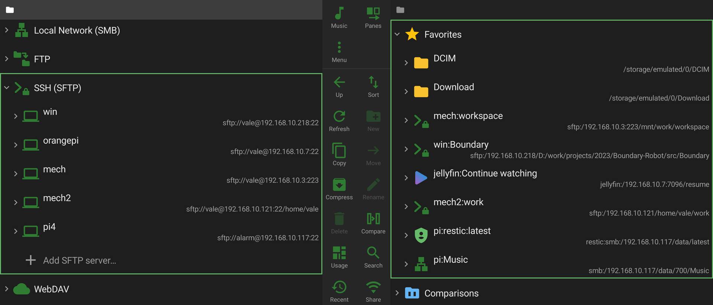
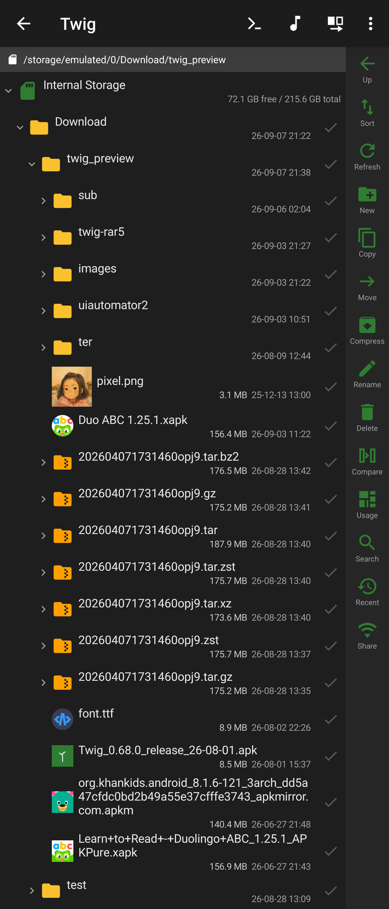
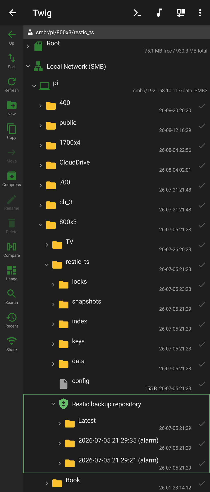
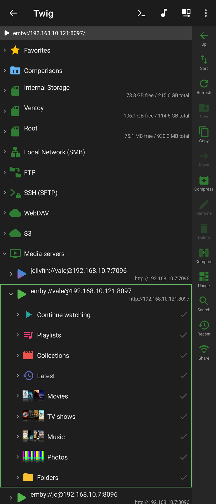
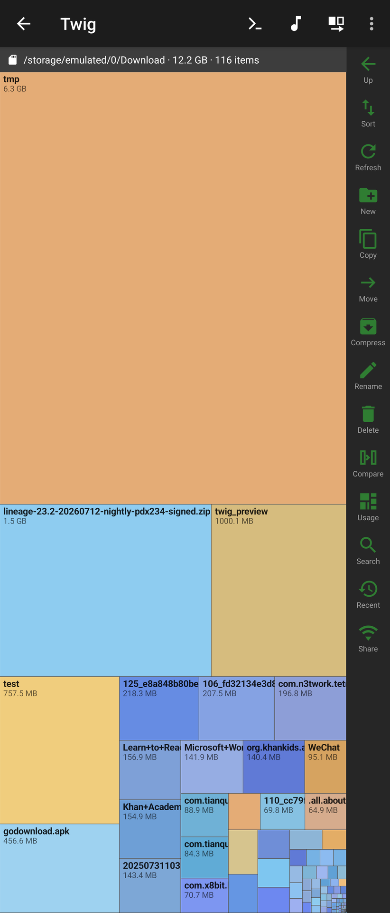
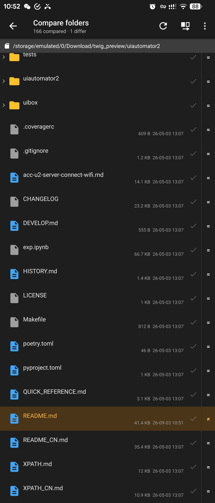
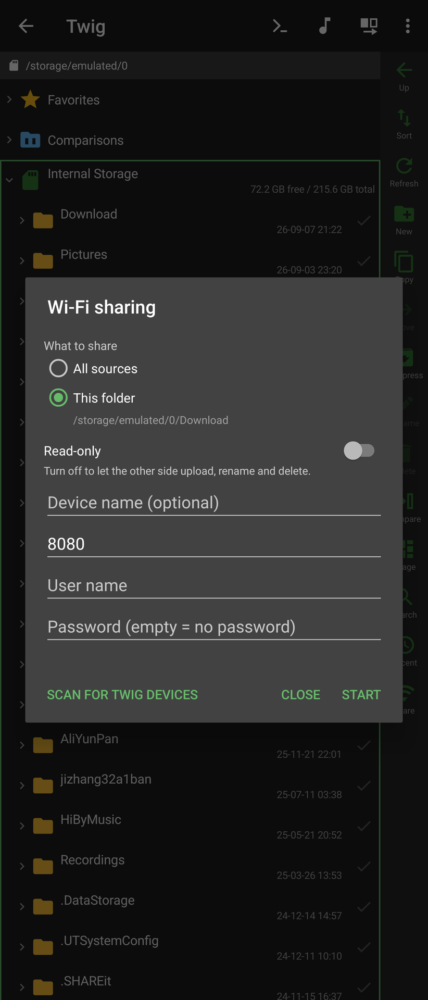
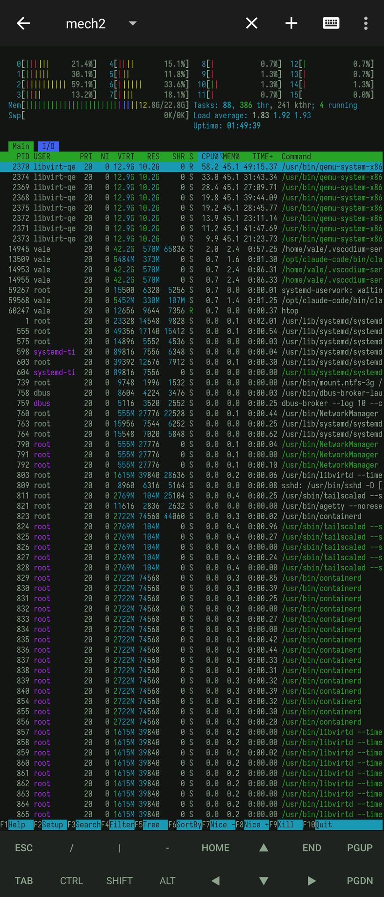

<p align="center">
  
</p>

<h1 align="center">Twig</h1>

<p align="center"><a href="README.md">English</a> · <strong>简体中文</strong></p>

一个体积优先的双面板 Android 文件管理器:所有来源都在同一棵树里就地展开,而不是各自
一个要「进去」的界面。原生 Kotlin + XML View,不引入 Material 库,依赖压到最低。
能手写就手写——WebDAV、S3 签名、git、restic 全部从零实现。

**版本 1.8.2**(versionCode 287)· minSdk 24 / targetSdk 34 / compileSdk 36 ·
[GPL-3.0](LICENSE)

<!-- 截图直接引用 fastlane/ 下的那份,不在这里再放一遍:F-Droid 要求它们位于那个
     确切路径,复制一份等于把同样的 2 MB 在仓库里存两次。 -->

<p align="center">
  
</p>

| 一棵树,所有来源 | restic 备份,设备上解密 | Jellyfin 媒体库当文件系统 | 占用图 |
|---|---|---|---|
|  |  |  |  |

<details>
<summary><strong>更多</strong> —— 目录对比、WiFi 共享、内置终端</summary>

| 目录对比 | WiFi 共享 | 内置终端 |
|---|---|---|
|  |  |  |

</details>

---

## 为什么是 Twig

**一棵树,所有来源。** 本地存储、压缩包、FTP、SFTP、SMB、WebDAV、S3、restic 仓库、
Jellyfin/Emby 服务器,对 UI 来说是同一个东西。任意两者之间的复制走同一条代码路径——SMB 上的目录可以直接
压成本地 zip,远程压缩包里的文件可以流式传到 FTP 服务器。

**它一直很小。** 单设备下载约 7.1 MB,而这里面**包含**了 FFmpeg 音频解码器、
一套 SMB 实现和一个视频播放器。同类文件管理器普遍是这个数字的几倍。加依赖之前
先算它的 APK 增量。

**它做到了别的文件管理器止步的地方。**

- **只读浏览 restic 备份仓库**,在设备上解密,快照按日期呈现为目录——据我们所知,
  Android 上没有第二个这么做的。
- **网络视频缩略图不下载整个文件。** Twig 自己解析容器(MP4 采样表、Matroska EBML
  Cues),定位到时长 1/10 处的关键帧,只取约 2 MB。74 GB 的远程 remux 也能在几秒内
  出图。
- **纯 Kotlin 从零写的 git 客户端**——状态、历史、双栏 patience diff、worktree 与
  子模块,本地仓库和远程仓库都支持。
- **真正的蓝光 M2TS 播放**:192 字节 BDAV 包、HDMV 私有 stream type(DTS-HD MA、
  经内嵌 AC-3 core 的 TrueHD)、PGS 位图字幕——这些 media3 都不直接支持。
- **root / Shizuku 特权访问是本地文件系统的回落**,不是另起一棵树。所以
  `/data/data/…` 往 SMB 复制、缩略图、搜索全都零改动可用。
- **媒体服务器当文件系统用。** Jellyfin 与 Emby 的媒体库像别的来源一样浏览,播放进度
  与服务器双向同步,海报、标签、歌词、外挂字幕全部走 API 拿,而不是去读媒体文件本身。
  **一份实现通吃两家,且零新增依赖。**
- **目录对比 + 单向同步**(Beyond Compare 式),而且两侧可以是**任意来源**——SMB 上的
  目录对本地目录、文档树对压缩包都行;同步分增量与镜像两种,目标侧更新的那些单独确认。
- **WiFi 共享**:Twig 反过来当 HTTP 与 WebDAV 服务器,电脑可以直接挂载——而且能下载
  位于 SMB 共享上、甚至压缩包内部的文件,因为对服务端来说它们都只是 `openInput()`。

---

## 体积

1.7.0 release 构建(R8 + 资源裁剪)实测:

| | 大小 |
|---|---|
| Release APK(`arm64-v8a` + `x86_64`) | 9.2 MB |
| **单设备下载(`arm64-v8a`)** | **≈ 7.1 MB** |

构成(APK 内的压缩后大小):

| 组件 | 大小 |
|---|---|
| `classes.dex`(自研代码 + 全部 JVM 依赖) | 2.8 MB |
| `libffmpegJNI.so` | 1.4 MB |
| Bouncy Castle 的数据文件 | 1.2 MB |
| 资源(`resources.arsc` + `res`) | 887 KB |
| `libsamba_jni.so`(libsmb2) | 484 KB |
| `libtwigzstd` / `libtermux` / `libtwigpty` | 109 KB |

Bouncy Castle 那一项几乎全是 `picnic` 后量子签名算法的三张查找表
(`lowmcL{1,3,5}.bin.properties`)。引入完整 Bouncy Castle 只是因为 Android 自带的
阉割版缺 X25519,所以这 1.2 MB 是纯粹的死重——见路线图。

每种来源都是独立的 Gradle 模块,所以构建时可以裁掉用不着的部分——去掉媒体播放与
网络来源,上表中的绝大部分就没了。

---

## 一句话架构

所有来源——本地、压缩包、FTP、SFTP、SMB、WebDAV、S3、restic、Jellyfin——实现同一套
`FileSystem` + `XFile` 接口,`CopyEngine` 通过 `openInput()` / `openOutput()`
在任意两者之间搬字节。

> **加一种来源 = 新增一个 `FileSystem` 实现。UI 与拷贝引擎零改动。**

由此白捡两件事:任意来源之间可以互拷;裁掉模块就能构建精简版本。

---

## 功能

### 存储来源

| 来源 | 能力 | 实现 |
|---|---|---|
| **本地** | 读写全功能 | `java.io.File` |
| **ZIP** | **读 + 写**,老包 GBK 名自动识别 | 当文件系统挂载,点开即进入 |
| **7z** | 读 + **打包写入**(LZMA2) | commons-compress + xz |
| **tar** | 只读 | 条目在包里是连续存放的,直接切片读——里面套着的压缩包不必先解出来就能打开 |
| **gz / xz / bz2 / zst** | 只读 | 不是归档而是单条数据流:挂成只有一个条目的包,于是 `foo.tar.gz` 打开是 `foo.tar`,再展开就是 tar,`.tgz`/`.txz`/`.tbz2`/`.tzst` 同理 |
| **zstd** | 只读 | 流式解压,复用 restic 已经带进包里的那份 libzstd,不多打一份 |
| **RAR** | 只读(RAR4 + RAR5) | junrar,单独一个模块——只有 `full` 版带,`libre` 版没有 RAR |
| **加密压缩包** | 读 zip/7z/rar,**创建** AES-256 zip/7z | WinZip AES 与老式 ZipCrypto 全手写 |
| **FTP** | 读写全功能 | Apache Commons Net |
| **SFTP** | 读写全功能 | SSHJ(带完整 Bouncy Castle 解决 X25519) |
| **SMB / CIFS** | 读写全功能 | libsmb2,经 NDK/JNI |
| **WebDAV** | 读写全功能 | 手写 PROPFIND/MKCOL/MOVE,不引 SDK |
| **S3 兼容对象存储** | 读写全功能 | 手写 SigV4 + REST——AWS S3、MinIO、R2、OSS、COS、B2 |
| **restic** | 只读,解密 | 从零实现;仓库格式 v1 与 v2 |
| **Jellyfin / Emby** | 只读虚拟树 | 手写 REST;一份实现通吃两家,零新增依赖 |
| **SAF 文档树** | 读写 | 没有 `MANAGE_EXTERNAL_STORAGE` 时的系统级回退 |
| **特权(root / Shizuku)** | 读写 | 不是独立来源,而是普通 API 够不着的本地路径的回落 |
| **已安装应用** | 只读虚拟树 | PackageManager;分包应用现打成 XAPK,复制出来的包不会漏掉 `split_config.*` |

网络来源展开即连接,支持多服务器(每台一个唯一 scheme),配置持久化。解压就是一次
跨来源复制,压缩也是——所以"把 SMB 上的目录压缩到本地"不需要任何特例代码。

### 浏览

- **一棵完整的树。** 顶级节点是内部存储、根目录、局域网(SMB)、FTP、SSH、WebDAV、
  S3、文档树和收藏。压缩包是可展开的文件节点。
- **永远就地展开,从不"进入"目录。** 当前目录就是你最后点的那个,它同时是新建、
  复制、移动的目标。
- 竖屏单面板(左右滑动切换),**横屏双面板并排**。
- 多选、跨面板复制/移动(带进度与取消)、新建目录、重命名、递归删除、剪贴板式粘贴。
- **收藏**与**最近位置**存的是"如何到达"(连接标签 + 路径),不是会话内的动态
  scheme,所以重启后依然有效。
- **恢复上次位置**,逐级展开;恢复期间一碰列表就交还控制权。
- **网格视图**,与缩略图开关正交,列数按面板宽度自适应。
- **属性卡片**内嵌在文件行下方:EXIF、媒体轨道、应用信息、哈希——全走系统 API,
  且绝不为了填一个字段去整读文件。
- **占用图**(SpaceSniffer 式 treemap)内嵌在面板里,双指缩放,长按菜单与树共用。
- **SD 卡与 U 盘**在树根上各占一行,名字与容量取系统给的。不新增任何权限——普通 API
  读不动的卷,可以用 SAF 授权,或者走特权侧列。
- **跳转到路径**:任何根行(服务器、内部存储、可移动卷、文档树、收藏)都能输入一条路径,
  树逐级展开到那个目录或那个文件所在的行;路上遇到没连的服务器会先连上。
- **分包 APK 直接安装**:`.xapk`、`.apks`、`.apkm` 从包里读出来写进 `PackageInstaller`
  会话,不用再装一个辅助 App。
- **Twig 可以当文件选择器**,对外接 `GET_CONTENT`,对内替掉 SAF——所以能选到
  SMB 共享里、压缩包里的文件,而系统选择器看不见这些来源。
- **添加到桌面**:目录和单个文件都能钉一个快捷方式——目录版展开到树里那一行;文件版
  还能选*怎么打开*(自动识别、文本查看、十六进制查看,或提前选定一个应用,因为快捷方式
  没法每次点都弹一次应用选择器),图标在已有缓存缩略图时直接用缩略图。跑在独立任务栈里,
  点开不会经过主界面。

### 对比

- **目录对比**(Beyond Compare 式):两侧逐行对齐,中间一列状态符号;横屏并排,竖屏一次
  显示一侧但状态列始终在。两侧可以是任意来源,小文件按**内容**比,而不是只看大小与时间。
- **单向同步**方向写死「同步到左侧 / 同步到右侧」,不跟着活动侧走(同步是不可逆的)。
  默认**增量**:只推源侧独有与两侧不同的,目标侧多余的保留;关掉即**镜像**,多余的一并
  删除。目标侧更新的那些单独列出,不勾就不覆盖。
- **保存的对比**与收藏并排放在树根上,常看的一对点一下就打开,也能直接从那行发起同步。
- **文本对比**双栏、长行横向同步滚动、逐差异块合并;**图片对比**并排,缩放平移联动。
- **二进制走 hex 对比。** 一个文件是不是二进制,只有读了才知道,所以判定为二进制、或者
  大到文本视图扛不住的那一对,会转交给 hex 对比而不是停在"无法比较"。两侧**按相同偏移
  对齐、不做重新同步**——对固件、改过的可执行文件这类结构固定的东西,这才是诚实的答案;
  短的那侧用空行补齐,否则它先到底,末尾的差异永远翻不到。

### 查看器与播放器

所有查看器都经 `FsRegistry` 读取,本地、压缩包内、远程文件一视同仁。

- 文本查看器,手写词法着色,多主题,捏合缩放字号,带 Markdown 预览模式
- **文本编码是设置项,不是猜**:统一走 `TextCodec`——BOM → 严格 UTF-8 → 你在设置里排好的
  候选(默认 GBK)。编辑不再只限 UTF-8:保存用读进来那个编码写回;原编码表示不了新输入的
  字符时会问你要不要转成 UTF-8,而不是静默替换成 `?`
- Hex 查看器,虚拟滚动、可拖动滚动条、文本/HEX 搜索
- **PDF 阅读器**,基于系统渲染器:连续或单页滚动、双击裁掉页边空白、文本选择,
  系统支持时还有全文搜索(Android 15+)
- 图片查看器(降采样防 OOM),幻灯片边扫边播,找到第一张就先显示
- **视频/音频播放器**(media3 + FFmpeg 软解),覆盖 AVI、真 M2TS、HDMV 私有音轨与
  PGS 字幕;系统解码器崩溃时两级自动降级
- **剧集自动连播**:Jellyfin/Emby 的队列由服务端给出,其余来源按文件名里的编号
  (`SxxExx`、`E01`、纯数字)分组。上/下一集按钮只在真的算得出队列时才出现
- 音乐播放器,带波形显示

### 媒体服务器(Jellyfin / Emby)

一份实现通吃两家——Emby 正是 Jellyfin 当年 fork 的上游,那批端点同源同名——而且
**零新增依赖**:OkHttp 本来就在,`org.json` 是 Android 运行期自带的。

- 树按**服务器上实际存在的媒体库**组织,用你自己起的库名,而不是写死的几个类型。
  电影库点进去直接是所有电影,剧集库是所有剧(只有多季时才分季),音乐库是
  专辑 / 专辑艺术家 / 艺术家 / 文件夹四个分类。
- **播放进度双向同步。**「继续观看」就是服务器上那份,不是本机另存的一份;而且保持
  服务端给的顺序,不套用你在文件浏览里选的排序。
- **海报、标签、歌词、外挂字幕全部走 API。** 这些信息若去读媒体文件本身,在网络上
  每首歌要花几秒。「继续观看」用横版剧照,媒体库用竖版海报并按原始比例显示。
- **搜索走服务端的索引**,所以刮削成中文名的片子,用原名照样搜得到。
- **设计上只读**:服务端没有上传 API,而 `DELETE /Items/{id}` 删的是媒体库里的真实文件。

### 终端

- **本地 shell** 跑在真 PTY 上,**SSH 会话**走 SSHJ,同一个会话列表,顶部切换
- **特权终端**(root / Shizuku)始终是单独一项、身份写在文案里——绝不把普通 shell
  悄悄换成 root
- 字体与配色可导入(任何 termux `colors.properties` 都能用);双指缩放字号,
  行列变化即同步远端 PTY;附加键条上的方向键长按可连发
- **命令快捷方式**:给 SFTP 目录或服务器挂一条命令,在终端里跑或后台静默执行,
  可固定到桌面

### Git

- `:git-lite` 从零实现 `GitRepo`、`ObjectStore`、`IndexFile` 与 patience `Diff`
- 状态与历史视图,双栏 diff 与文本查看器共用着色器
- 本地仓库直读,SFTP 仓库经远程 `exec git`
- **worktree 与子模块**处理到位,包括 `gitdir:` 里记的绝对路径在本机不存在的情况
- 虚拟的**「工作区」节点**列出同一仓库的其他 worktree,点进去就是那条工作区完整的
  状态/分支/历史视图

### WiFi 共享

直接在 `ServerSocket` 上手写的极小 HTTP/1.1 服务,零新增依赖。电脑浏览器输 IP 就是
目录列表 + Range 下载 + 拖拽上传;同一个端口同时说 **WebDAV**,Finder、资源管理器
或另一台 Twig 都能直接挂载。**默认只读**,可选 Basic 认证,前台服务 + WiFi 锁,
UDP 探测让另一台 Twig 扫一下就能把它存成连接。

### 安全

- 密码、API key、token、私钥口令**加密落盘**:一把随机 256 位 DEK 加密这些字段,DEK 外面
  套硬件 Keystore 密钥(默认,无感)或 scrypt(用户设的主密码)。开关主密码只换「谁包住
  DEK」,字段密文一个字节都不重写。零新增依赖:scrypt 用的是包里早就有的 Bouncy Castle。
- 主密码是**程序锁,六个入口全守**——主界面、「用 Twig 打开」、「复制到此」、文件选择器、
  终端快捷方式、远程命令快捷方式。漏掉一个,主密码就只锁了正门。菜单里的「锁定」只丢掉
  内存中的密钥,音乐照放、终端还在、共享继续。文件桌面快捷方式是唯一刻意的例外:本地和
  SAF 文件打开不需要解密任何东西,直接跳过;只有指向服务器的文件才会先解锁,因为重连要
  用到保存的(加密)凭据。
- **指纹解锁**走平台 `BiometricPrompt`(不引 androidx.biometric,APK 增量为 0),与主密码
  并存;主密码始终是根钥匙。
- **配置备份**(`.twigbak`):连接与设置导出成 JSON,可选用单独的导出密码加密;保存位置走
  Twig 自己的目录选择器——所以能直接存到 SMB / WebDAV / S3。导入是合并不是替换,
  token、host key 与 DEK 一律不导出。

---

## 模块

| 模块 | 内容 |
|---|---|
| `:core-fs` | 纯 JVM:`XFile` / `FileSystem` / `FsRegistry` / `CopyEngine` |
| `:fs-local` | `LocalFileSystem` + `priv/`:root/Shizuku 共用的特权 shell 回落 |
| `:fs-archive` | `ArchiveFileSystem` + zip(读写、加密)/ 7z / tar / gz·xz·bz2·zst 单文件压缩,以及 `ArchiveWriter` |
| `:fs-archive-rar` | `RarFileSystem`(RAR4 + RAR5)——单独成模块纯粹是为了让 `libre` 版能整块去掉 |
| `:fs-network` | `FtpFileSystem` / `SftpFileSystem` / `WebDavFileSystem` / `S3FileSystem` / `JellyfinFileSystem` |
| `:fs-smb` | `SmbFileSystem`——libsmb2,经 NDK/JNI |
| `:fs-restic` | restic 仓库读取器(纯 Kotlin) |
| `:fs-zstd` | `NativeZstd`——zstd,经 JNI |
| `:git-lite` | 纯 Kotlin 迷你 git |
| `:app` | 双面板 UI、查看器、终端、Git 视图、占用图、WiFi 共享 |

---

## 构建

```bash
./gradlew :app:assembleDebug      # 可安装的 debug APK
./gradlew :app:assembleFullRelease     # R8 优化的 release(带 RAR)
./gradlew :app:assembleLibreRelease    # F-Droid 版(无 RAR,100% 自由软件)
./gradlew :app:bundleRelease      # 上架用 AAB(按设备拆分,下载更小)
```

release 只有在仓库根存在 `keystore.properties` 时才签名(内含 `storeFile` /
`storePassword` / `keyAlias` / `keyPassword`)。没有它时产出的是**无签名包**
`app-<flavor>-release-unsigned.apk`,**不会**回落到公开的 Android debug key。
自己签,或者本地测试直接用 debug 包。

测试:

```bash
./gradlew :core-fs:test :fs-archive:test :fs-network:test :fs-restic:test :git-lite:test
./gradlew :app:testReleaseUnitTest
```

说明:build-tools 固定 36.1.0;只构建 `arm64-v8a` 与 `x86_64`;R8 开启,
libsmb2 与 zstd 的 JNI 入口按名 keep。

### 加一种新来源

1. 新建模块 `:fs-xxx`,实现 `com.twig.core.FileSystem`
2. 启动时注册:`FsRegistry.register(XxxFileSystem())`
3. 给用户一条导航到 `XxxFileSystem.root()` 的入口

浏览、复制、移动、删除、缩略图、搜索随即全部可用,无需改动。

---

## 许可

Twig 采用 **GPL-3.0-only**,见 [LICENSE](LICENSE)。

这是继承来的而不是选的:Termux 终端模拟器与 Jellyfin FFmpeg 解码器都是 GPLv3,
链接它们导致整个应用必须是 GPLv3。

- [LICENSE-EXCEPTIONS.md](LICENSE-EXCEPTIONS.md) —— 与 UnRAR 许可下的 `junrar`
  链接的附加许可、该许可要求的声明、LGPL 重新链接说明,以及商标保留
- [THIRD_PARTY.md](THIRD_PARTY.md) —— 全部第三方组件及其版本与许可

**商标。** "Twig" 名称与应用图标不在 GPL 授权范围内。代码可以自由 fork 和修改;
再分发修改版时请更换名称与图标,以免用户误认它来自本项目。

**RAR 声明。** 按 UnRAR 许可的要求:本程序中处理 RAR 的代码不得用于开发与 RAR
(WinRAR)兼容的压缩器。Twig 只解压 RAR,不实现 RAR 压缩。

---

## 参与贡献

欢迎贡献。请先读 [CLA.md](CLA.md)——很短,不拿走你的版权,并解释了为什么这个项目
需要保留对自研代码另行授权的权利。

签署方式是在 PR 描述里加一行:

```
I have read the CLA (CLA.md) and I agree to its terms.
```

实现决策记在 [AGENTS.md](AGENTS.md),那一长串代价高昂的排错记录按领域拆在
[docs/lessons/](docs/lessons/) 下,一个领域一个文件。改终端、缩略图、TS 解复用这类
子系统之前,先读对应那份。

---

## 路线图

- `:fs-cloud` —— Google Drive / Dropbox / OneDrive,走纯 REST,不用各家 SDK
- 全局搜索
- 体积:干掉 Bouncy Castle 那 1.2 MB 的 `picnic` 查找表,或者整个换成 Conscrypt
  ——两条路都需要真机验证 SSH 握手仍然找得到 X25519

---

<details>
<summary><strong>演进史</strong></summary>

- **Phase 1** —— `FileSystem`/`XFile` 抽象与 `CopyEngine`;本地文件系统;双面板 UI;
  多选/复制/移动/新建/改名/删除;R8 + 资源裁剪 + AAB 拆分。
- **Phase 1.5 / 1.6** —— 文本/Hex/图片查看器经 `FsRegistry` 通用;用其他应用打开;
  复制进度与取消;SAF 回退。
- **Phase 2 / 2.5** —— 压缩包挂载:ZIP 从只读到读写(GBK 自识别);7z / RAR 只读;
  解压复用 `CopyEngine`。
- **Phase 3 / 3.5 / 3.6** —— FTP,然后是 libsmb2 的 SMB,然后是 SSHJ 的 SFTP 与
  手写 WebDAV;连接持久化与多服务器管理。
- **Phase 3.7** —— restic 仓库只读解密浏览,支持格式 v1 与 v2。
- **0.8 / 0.9** —— 树式模型定型:就地展开、展开即连接、竖屏单面板 +
  横屏双面板、深色主题。
- **0.12** —— 收藏,覆盖全部来源,按需连接直达。
- **0.45** —— 网格视图与缩略图开关解耦(正交)。
- **0.62** —— 幻灯片:边扫边播、随机播放显示真实下标、悬浮栏自动隐藏。
- **0.65** —— 位置记忆修复 + 最近位置历史;「跳转到所在目录」精确定位到文件行。
- **0.70** —— **压缩打包**:打包到对侧当前目录,可选 zip/7z 与移动模式,天然跨来源。
- **0.73** —— 横屏布局重整:隐藏 Toolbar、操作列改双列、路径栏改 `类型:/服务器/路径`。
- **0.74** —— 分组排序扩展到树式列表;修「展开位置没被记住」与「勾选时整列表闪一下」。
- **0.77** —— 终端外观三件套:字体导入(判据是 advance 0.5em)、配色、双指缩放修复。
  Twig 可作文件选择器。
- **0.78** —— SFTP 命令快捷方式,终端或后台静默执行,可固定到桌面。
- **0.79** —— **本地 shell 终端**,走 termux 原生 PTY——不需要桥接线程、断线重连、
  resize 探测那套远程逻辑。
- **0.80** —— 本地 shell 好用起来:`CmdShims` 绕开「PATH 目录对应用 uid 不可读」,
  `SshHome` 给 OpenSSH 备好全绝对路径的 config,`.mkshrc` 把前缀搜索历史绑到上下键。
- **0.96** —— **WiFi 共享**:手写 HTTP/1.1 服务,同一端口兼说 WebDAV,暴露的是整个
  `FsRegistry`——浏览器能直接下载 SMB 上、甚至压缩包内的文件。
- **0.97 / 0.98 / 0.99** —— 共享返工:「所有来源」按能否真的浏览来筛、按名字逐级解析
  路径、修正非 ASCII 路径的链接编码;网页端重做(就地预览、排序、批量操作);
  入口挪到操作列。
- **1.00** —— **压缩包密码**:读加密的 zip/7z/rar,创建 AES-256 加密包。zip 那套是
  手写的——commons-compress 与 `java.util.zip` 对加密 zip 连读都不支持。
- **1.01+** —— 往已有 zip 里加文件改成真追加(100MB 包实测 1875ms → 1ms);展开压缩包
  等于选中包根;**S3 兼容对象存储**(手写 SigV4);root / Shizuku 特权访问,含基于
  `bindUserService`、在特权侧分配 PTY 的特权终端。

- **1.1** —— **Jellyfin 与 Emby** 成为一等来源:树按服务器自己的媒体库组织,播放进度
  双向同步,海报/标签/歌词/字幕改从 API 拿而不是读媒体文件,搜索走服务端索引,剧集
  自动连播。零新增依赖。连播对普通来源也可用(按文件名里的编号分组);另外只读来源上
  的写操作入口现在直接不出现,而不是点下去才报错。
- **1.2** —— **目录对比同步**:增量或镜像,方向写死左右两项而不跟着活动侧,目标侧更新的
  那些单独确认。**RAR5** 支持(junrar 升到 8.1.0,顺带修掉「密码错了却说对」);拆出
  `libre` / `full` 两个 flavor,junrar 单独成模块移出 libre,F-Droid 版 100% 自由软件。
  导航栏底色跟着当前页面走,底部不再是一道黑边。
- **1.3** —— **安全**:保存的密码经两层 Keystore 密钥加密落盘;主密码升级为程序锁,六个
  入口全守;指纹解锁;`.twigbak` 配置备份走 Twig 自己的目录选择器(所以能直接存到
  SMB / WebDAV)。**SD 卡与 U 盘**在树根上直接给入口。行高与文字大小拆成两档独立偏好,
  一次调好的项目从菜单收进设置页;自适应图标 + Android 13 主题图标;应用图标长按菜单
  新增「终端」。
- **1.4** —— 别的应用授权的文档树按**那个应用**命名并用它的图标,不再显示一长串 document
  id;授权也能从侧栏交还。
- **1.5** —— 任意根行都能**跳转到路径**;收藏与保存的对比可以指到文档树里面;终端附加键条
  打磨(方向键长按连发、整条键条共用一个字号),息屏再亮不再丢掉模拟器尺寸。
- **1.6** —— **tar,以及 gz/xz/bz2/zst 单文件压缩。** tar 里的条目按偏移切片就地读取,
  所以里面套着的压缩包不必先解出来就能打开、里面的视频还能 seek;单流格式挂成只有一个
  条目的包,于是 `foo.tar.gz` 打开是 `foo.tar`,再展开就是 tar,`.tgz`/`.txz`/`.tbz2`/
  `.tzst` 同理。容器里没记原始大小的,大小显示留空,不再写成 `0 B`。
- **1.7** —— 内置 **PDF 阅读器**:连续或单页滚动、双击裁掉页边空白、文本选择,系统支持时
  还有全文搜索(Android 15+)。判定为二进制、或大到文本视图扛不住的那一对,转交 **hex 对比**。
  **分包 APK**(`.xapk`、`.apks`、`.apkm`)经 `PackageInstaller` 直接安装。SMB 不填共享名即
  列出全部共享,FTP / SFTP / S3 连接可指定起始路径。文本编码候选里 GB18030 取代 GBK。
  值得一提的修复:AVI 声音重组帧与 B 帧顺序、4K 网络播放撑爆堆、SSH 上的 git 工作区。
- **1.8** —— 单个文件也能钉**桌面快捷方式**了,不再只有目录能:可以选怎么打开——自动识别、
  文本查看、十六进制查看,或者提前选定某个应用(快捷方式没法每次点都弹一次应用选择器);
  图标在已有缓存缩略图时直接用缩略图。主密码只在目标真的需要解密时才弹——服务器文件要靠
  保存的加密凭据重连,本地和 SAF 文件从来不需要。快捷方式跑在独立任务栈里,打开不会经过
  主界面,返回也不会绕回主界面。

</details>
